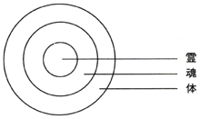
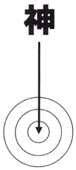
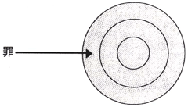
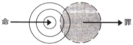
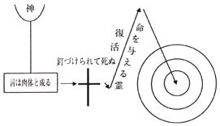
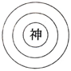
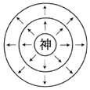

<iframe src='https://www.youtube.com/embed/SFWozG05k28' frameborder='0' allowfullscreen></iframe>

-----

# 人生の奥義 

>「その奥義は、啓示によって
わたしに知らされました」　エペソ３章３節

## 人の生存の目的

あなたは考えてみたことがありますか？　あなたは何のためにこの世に生きているのでしょうか？　人生の目的は結局
何でしょうか？　あなたがどんなタイプの人であっても、あなたの職業が何であっても、幾つかのことはすべての人が認めています。  
すなわち、  
　　お金は人を満足させることができません。  
　　学問も人を満足させることができません。  
　　楽しみも人を満足させることができません。  
　　成功も人を満足させることができません。  

なぜでしょう？  
なぜならあなたはまだ認識していないからです。

## 神の計画

神に一つの計画があります、この計画は人ととても大きな関係があります。この計画は、聖書の中で神のエコノミーと呼ばれています[^1]   
神のエコノミーとは人に対する神の計画全体のことです。それは人はどこから来て、どこへ行くのか、人生の意義は何であるのかを解き明かします。

**どのようにして神のエコノミーを知ることができるでしょうか？**

## 四つのキー（かぎ）
　
神はあなたのために、神のエコノミーを開く四つのキーを用意されました。この四つのキーはすべて聖書に記載されています。この四つのキーはいずれも重要で、欠くことができません。  
今どうかあなたの心を開いて、静かに注意深くこのホームページを読んでください。そうすればこの四つのキーを把握することができ、神のエコノミーがはっきりし、人の生存の意義を認識し、満ち足りた人生を踏み出すことができます。  
   
   
 [^1]: エペソ1：10「実現されるご計画にほかならない」（口語訳）の原文は「エコノミーへ至るためです」。エコノミーの原文は「Oikonomia」、神の計画を指す。

------

# 第一のキー　神の創造 
人の存在の奥義を開く
----

## 人は神のかたちをしています

どうぞ次の聖書の言葉を読んでください。  

>「神は言われた、『われわれのかたちに、われわれの姿に人を造り』。創世記1：26前半  

　神による人の創造は、彼による他のすべての創造とは異なっています。  
　神は人をご自身のかたちに造られました。  
　手袋は手のかたちに作られます。その目的は手を入れることです。  
　同じように、人は神のかたちに造られました、その目的は神を入れるためです。  

## 人は器です

それでは次の聖書の言葉を読んでください。

>神は「栄光へとあらかじめ用意しておられたあわれみの器に、彼の栄光の豊富を知らせようとされたとすれば、
どうなのですか？」。ローマ9：23

　わたしたちは神の器です。  
　神はわたしたちの内容となりたがっています。  
　水のビンは水を入れるためにあります。  
　同じようにわたしたちは神を入れるためにあります。確かに、知識、富、楽しみ、成功はどれもあなたを満足させることができないはずです。なぜならあなたが造られたのは神を入れるためだからです！

## 人の分析

どうぞ続けて次の聖書の言葉を読んでください。

>「あなたがたの霊と魂と体とを完全に守って、・・・くださいますように」。Ⅰテサロニケ5：23

　人は神の器です。この器を聖書は三部分に分けています。**霊**と、**魂**と、**体**です。図を見てください。  

**体**とは肉体のことです。生理学上の領域に属し、物質界の物事に触れ、最も表面的な部分です。

**魂**とは考える機関です。心理学上の領域に属し、心理の世界の事柄に触れ、より深い部分です。

**霊**は人の最も深い部分です。霊の領域に属し、神の事柄に触れます。

体に病気があれば医者にかかることができます。  
心に病気があれば精神医にかかることができます。  
しかし霊の問題は神だけが解決することができるのです。  

 
## 神のエコノミー

神は人の霊の中に入り、  
人の内容となり、  
人の満足となりたがっています。  
これこそ人の存在の意義です！  
あなたが造られたのは、  
ただ単に食物を胃の中に入れるためではありません。  
また知識を頭の中に入れるためでもありません。  

それは神をあなたの霊の中に入れるためです。  

----
  
# 人の堕落
人の持つ善の性質と悪の性質との奥義を開く
-----

## 人の二つの性質
　
人は神のかたちに造られました。このためすべての人に神の性質と一致する「善の性質」すなわち誠実、善良、美、
知性、親切、勇気などの美徳があります。  
ところが、人の内にはまた「悪の性質」もあって、「善の性質」と争い合います。これは中国哲学のいわゆる「道理と欲の争い」です。古今東西を問わず、人の性質を認識している人たちは皆この事実を認めます。この「悪の性質」が聖書の言っている：

## 罪です
　
　罪は人の内にあるので、人は良いことをしようと願っても、それを実行することができません。  
   　　どん欲、しっと、人殺しを願う人はありません。  
  　　 おごり、高ぶり、欺きを願う人はありません。  
   　　いらだち、汚れ、情欲を願う人はありません。  
   　　ぐち、不平、のろいを願う人はありません。  
　ところが反対に、人にはこれらの「悪の性質」からのがれることができないのです。  
　どうか次の聖書の言葉を読んでください。  

>「わたしは自分の中に、すなわち、自分の肉の中に、善なるものが住んでいないことを知っています。なぜなら、わたしは善をしようと欲するのですが、善を行なうことはないからです」。ローマ7：18

>「もしわたしが欲していないことを行なうなら、それを行なうのはもはやわたしではなく、わたしの中に住んでいる罪です」。
ローマ7：20

　これはまさに人の描写です.。

## 人の堕落

　罪は人の内には入ってきて、人を堕落させました。図を見てください。

### 罪は人の霊を死なせました

>「ところであなたがたは、自分の違反と罪の中に死んでいて」。エペソ2：1

### 罪は人の思いを背かせました

>「かつてあなたがたは神から離れていて、悪い行ないのために、あなたがたの思いの中で敵であったのです」。
コロサイ1：21

### 罪は人の体に罪を犯させました

>「あなたがたは死ぬべき体の中で、罪に支配させて、体の情欲に従ってはなりません」。ローマ6：12

　人は堕落しました。それはまるで：  
　一台のこわれたラジオのように、音楽を放送できないだけでなく、いつも雑音を発し、調節できません。  
　またちょうど：  
　みぞに落ちたコップのように、本来のすばらしい形は残っていても、今では泥にまみれています。

## 人は自分を救うことはできません
　
　人は昔から、あらゆる方法を尽くし、罪を犯すことから逃れようとしてきましたが：

　良い行ないをすることは罪から人を救い出すことができません。

　教育は罪から人を救い出すことができません。

　道徳は罪から人を救い出すことができません。

　お経を読むことは罪から人を救い出すことができません。

　仏像を拝むことは罪から人を救い出すことができません。

　人生の描写は、まさに善の性質と悪の性質が互いに争っている絵です！

----

# 第三のキー
キリストの贖い（あがない）
神・人の生と死の奥義を開く
---

## キリストとはどのような方でしょうか？

　キリストは、神に遣わされてこの世に来られ、人生の問題を解決される救い主です。
　

彼は三一（さんいち）の神の具体的表現です。

>「なぜなら、キリストの中には、神たる方の全豊満が肉体のかたちをもって住んでいるからです」。コロサイ2：9

　彼はまた神が肉体となられた方です。

>「言（ことば）は神であった。・・・言（ことば）は肉体と成って、わたしたちの間に幕屋を張られた。・・・恵みと実際に満ちていた」。ヨハネ1：1,14。

　ですから、彼の全体は神であり、また彼は完全な人です。
　どうか図を見てください。  

彼は善人をさらに超えた方です！  
彼は偉大な人をさらに超えた方です！  
彼は道徳的な人をさらに超えた方です！  
彼は聖人をさらに超えた方です！  
彼は、神・人なのです！  

## 神・人の死
　
この方、神・人は十字架に釘づけられ、贖い（あがない）のわざを完成されました。彼は三種類の身分をもって死なれたのです。

1 神の小羊として、彼の死は人の罪を取り除きます。
> 「世の罪を取り除く神の小羊」。ヨハネ1：29

2 上げられた銅の蛇として、彼の死は古い蛇---サタンを滅ぼし、人の内側にある蛇の毒---罪の性質を対処します。
> 「そして、モーセが荒野で蛇を上げたように、人の子も上げられなければならない」。ヨハネ3：14

3 一粒の麦として、彼の死は神聖な命を解き放ちます。
>「一粒の麦が・・・死んだなら、多くの実を結ぶ」。ヨハネ12：24

今：  
　彼の死は、人が持つべきではないのに持っている罪を取り除きます！  
　彼の死は、人が持つべきなのに持っていない命を与えます！

 ----

# 第四のキー　神の分与
主イエスを信じる奥義を開く
---

## キリストの二回の「成った」
　
神は肉体と成り、人として生まれ、イエスと呼ばれました。どうぞ次の聖書の言葉を読んでください。

>「言（ことば）は肉体と成って、わたしたちの間に幕屋を張られた」。ヨハネ1：14

　主はその霊と「成り」ました。それは死からの復活によってであり、命を与える霊と呼ばれます。どうぞ次の聖書の言葉を読んでください。

>「最後のアダムは、命を与える霊と成ったのです」。Ⅰコリント15：45

この霊は「命を与える霊」ですから、命をもたらし、神を信じる人の中へと神を分与します。

ですから、聖書は言っています。

>「御子を持つ者は命を持っています。神の御子を持たない者は命を持っていません」。Ⅰヨハネ5：12

## 人を再生させる

　人は初めに生まれた時、肉体の命を得ます。
　人はキリストから神の命を得ます、これは第二の誕生で、聖書はこれを「再生」と言っています。

>「神は・・・イエス・キリストの死人の中からの復活を通してわたしたちを再生し」。Ⅰペテロ1：3

>イエスは・・・言われた、「人は新しく生まれなければ、神の王国を見ることはできない」。ヨハネ3：3

　豚がもし羊の王国に属し、羊の生活をしたくても、それは、教育、改良、規制によっては不可能です。そのためには必ず羊の命を持たなければなりません。
　同じように人が神の王国に属して、神聖な生活をしたくても、やはり、教育、改良、規制によっては不可能です。彼は必ず神の命を受けなければなりません！

## クリスチャンとなる意義

　クリスチャンとは神を分与された人です。まず神はご自身をわたしたちの霊の中に分与されます。次に、わたしたちの霊から魂の中に広がります。最後に、わたしたちの霊と魂と体すべてに神を満たし、神を浸透させます、聖書はこうした結果を「栄光化される」と言っています。

>「あらかじめ定めた者たちを、さらに召し、そして召した者たちを、さらに義とし、そして義とした者たちを、さらに栄光化されました！」ローマ8：30

　このようにして、わたしたちは変化させられ、キリストのかたちにかたちづくられます。

>「神はあらかじめ知っておられた者たちを、御子のかたちに同形化しようと、あらかじめ定められたからです」。ローマ8：29

　　これこそ人生の目的です！  
　　これこそクリスチャンとなる意義です！  
　　これこそ神があなたのために定められた計画です！  
今あなたはどうすべきでしょうか？  
　今あなたは神のご計画がわかりました。あなたは四つの事を行なうべきです。  

### 神に心の向きを変える---悔い改め
　悔い改めは、過去のあやまちをひどく後悔することではありません。  
　悔い改めは、あやまちを改め、決心してやり直すことではありません、悔い改めは「思いを向け変える」ことです。  
　以前あなたは神に背いている人でした。良いことをしようが、悪いことをしようが、あなたは神に背いていました。あなたの思いが神に背いていたのです。  
　今どうか主イエスの言葉を聞いてください。

>「悔い改めよ、天の王国は近づいた」。マタイ4：17

## 信じる---受け入れる
　信じるとは、うなずくことではありません。同意することではありません。鑑賞することではありません。もし人があなたに腕時計を贈るとします。あなたはうなずき、同意し、鑑賞するだけでは十分ではありません。あなたは受け取る必要があります。信じるとは受け入れることです。どうぞ次の聖書の言葉を読んでください。

>「すべて彼を受け入れた者、すなわち、御名の中へと信じる者に、彼は神の子供たちとなる権威を与えられた」。ヨハネ1：12

## 告白---呼び求める

　クリスチャンになるのは、おおやけのことです。神は「心」で信じ、「口」で告白することを求められます。  
　もし心で信じないなら、救われません。  
　もし口で告白しないなら、やはり救われません。  
　しかし：  

>「あなたが自分の口で、イエスは主であると告白し、自分の心で、神は彼を死人の中から復活させたと信じるなら、あなたは救われます」。ローマ10：9

## バプテスマされる---証しする

　バプテスマされることは人の面前で証しすることです。信じた人はだれでもバプテスマされるべきです。そうすれば、彼らは神の面前で救われるだけでなくまた人の面前でも救われるのです。

　主イエスは言われました。

>「信じてバプテスマされる者は救われる．　しかし、信じない者は罪に定められる」。マルコ16：16

　バプテスマによって、神はわたしたちをサタンの国から、神の王国の中に移されます。ですから主イエスはまた言われました。

>「まことに、まことに、わたしはあなたに言う．　人は水と霊から生まれなければ、神の王国に入ることはできない」。ヨハネ3：5

 
 	
今どうか祈ってください
-----
　「主イエスよ！　わたしは一人の罪人です。わたしはあなたが必要です。わたしの霊の中に入ってきて、わたしの罪を取り除いてください。わたしを満たしてください。わたしに神の命を持たせてください。わたしは今あなたをわたしの救い主とし、命として受け入れます。わたしは自分をあなたにささげます。主の御名によって求めます。アーメン！」。

　今あなたは人生の奥義がわかりました！　どうか主があなたを祝福し、ずっと神のご計画の中に生きさせてくださいますように！  
　もしあなたが神のエコノミーについてさらに学び、またキリストの救いのさらに深い経験を得たいなら、どうか、もっと話し合うためにわたしたちと交わりを持ってください。

「人生の奥義」  
著者　ウイットネス・リー  
発行所　(有)日本福音書房

