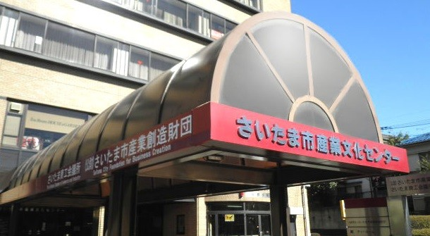

<iframe src='https://calendar.google.com/calendar/embed?src=ja.japanese%23holiday%40group.v.calendar.google.com&ctz=Asia%2FTokyo' style='border: 0' width='800' height='600' frameborder='0' scrolling='no'></iframe>

------

11月の集会案内

　　４日（主日）

　１１日（主日）全国東海特別集会のため、集会所はお休みです。

　２８日（主日）

　２５日（主日）

集会は１０時３０分から１２時３０分

集会後、愛餐があります。

ともにエンジョイしましょう！

-------

東海全国特別集会のお知らせ

浜松駅　えんてつホールにて

　１１月１０日（土）

　　　15:00集会１

　　　19:00ブレンディング集会

　１１月１１日（主日）

　　　 9:30パンさき集会

　 　10:00集会２

　　13:00集会３（働きの集会）

　　15:15ブレンディング旅行

-------

福音集会　１２月２３日（主日）１２時　

於　さいたま市産業文化センター

WELCOME!!

主催　　　さいたまに在る教会

アクセス　埼京線　与野本町駅より徒歩７分

　　　　　さいたま市中央区下落合5-4-3

TEL 048-854-0486

