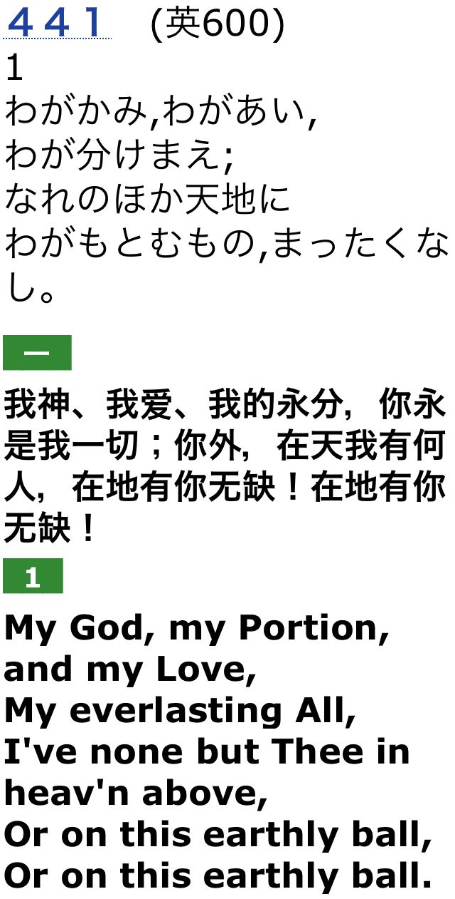

# 実行

> エペソ4章「ついに私たちすべては、その信仰の一に、また神の御子を知る知識の一に到達し、一人の完全に成長した人に到達し、キリストの豊満の身の丈の度量にまで到達するのです。」

> 教会に関する主の意図は、「山の上の型」にしたがった意図です。教会は山の上の型が何であるかを見いださなければなりません。教会は神の標準を自分の標準としなければなりません。（ウオッチマン・ニー全集第６２巻第２２編「山の上の型にしたがった教会の回復」１９５０年２月１７日金曜日夜、香港九龍佐敦道）

# 詩歌

