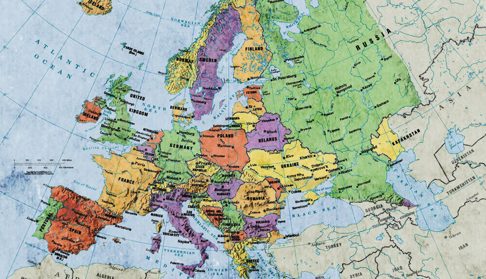

>「ここに二つの面があります。一つの面は、どんな事に対しても調和一致していることであり、もう一面は、どんな事に対しても祈ることです。わたしたちは必ず神によってこの点にまでもたらされなければなりません。」（ウオッチマン・ニー全集、第22巻、「召会の祈りの務め」、第1編より抜粋）

# さいたま祈りの項目

- ２０１９年１０月を目途に駅近くに集会所を買い替える、ま たは埼玉大学近辺に第２集会所を得るために、祈り、探し、交 わり、獲得する。
〇毎月第１主日の福音行動に兄弟姉妹が組み合わされて出てい き、ヨベルの祝福と自由を享受できるように  
- １２月２３日のさいたま産業文化会館での福音集会の１００ 名会場が人で満たされるように

## 祈りと奉仕の集会2018.11.3Sat

- 新集会所取得のために

- 東海全国特別集会のために

- 12月23日福音集会のために

>> マタイ24:14 そしてこの王国の福音は、すべての民に対する証しのために、人の住む全地に宣べ伝えられる。それから終わりが来る。

